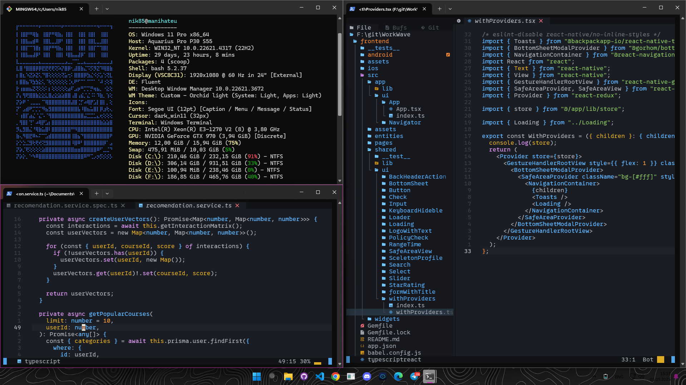

<p align="center">
  
</p>

<h1 align="center">
  <span style="color: #FFAE00;">manihateu</span> 
  
</h1>

<p align="center">
   <span style="color: #b0b0b0; font-size: 18px; font-family: 'Courier New', monospace;">
      ███╗░░░███╗░█████╗░███╗░░██╗██╗██╗░░██╗░█████╗░████████╗███████╗██╗░░░██╗<br>
      ████╗░████║██╔══██╗████╗░██║██║██║░░██║██╔══██╗╚══██╔══╝██╔════╝██║░░░██║<br>
      ██╔████╔██║███████║██╔██╗██║██║███████║███████║░░░██║░░░█████╗░░██║░░░██║<br>
      ██║╚██╔╝██║██╔══██║██║╚████║██║██╔══██║██╔══██║░░░██║░░░██╔══╝░░██║░░░██║<br>
      ██║░╚═╝░██║██║░░██║██║░╚███║██║██║░░██║██║░░██║░░░██║░░░███████╗╚██████╔╝<br>
      ╚═╝░░░░░╚═╝╚═╝░░╚═╝╚═╝░░╚══╝╚═╝╚═╝░░╚═╝╚═╝░░╚═╝░░░╚═╝░░░╚══════╝░╚═════╝░
  </span>
</p>

<p align="center">
  <span style="color: #b0b0b0; font-size: 18px;">
    Middle+ Frontend developer | Middle+ Mobile developer | Middle Backend developer
  </span>
</p>

## 🖤 Обо мне

```python
class Developer {
    constructor() {
        this.name = "manihateu";
        this.role = "FullStack Developer (Frontend Focus)";
        this.education = "🎓 4 курс университета";
        this.experience = "⚡ 4 года коммерческого опыта во Frontend-разработке";
        this.passion = "Я НЕ НОРМАЛЬНЫЙ!";

        this.stack = {
            frontend: {
                frameworks: ["React", "Next.js"],
                buildTools: ["Webpack", "Vite"],
                stateManagement: [
                    "Redux", "@reduxjs/toolkit", "Effector", 
                    "Jotai", "Zustand"
                ],
                styling: [
                    "SCSS", "Styled Components", "TailwindCSS", 
                    "Framer Motion"
                ],
                auth: ["JWT", "Sessions", "Keycloak", "OAuth"]
            },
            mobile: {
                main: ["React Native", "Expo"],
                native: ["NativeWind", "Reanimated 2"],
                deployment: ["AppStore", "Google Play"]
            },
            backend: {
                main: ["Nest.js"],
                databases: ["PostgreSQL", "MongoDB", "Redis"],
                orm: ["Prisma", "TypeORM"],
                advanced: ["WebSockets", "GraphQL", "CRUD"]
            },
            devOps: ["Docker", "GitHub Actions", "CI/CD"],
            workflow: ["Jira", "Trello", "Scrum", "Retro"]
        };
    }

    toString() {
        return `${this.name} | ${this.role}`;
    }

    printBio() {
        console.log(`\n${this.toString()}\n`);
        console.log(`🔥 ${this.passion}\n`);
        console.log("🚀 Мой стэк:\n");

        for (const [category, technologies] of Object.entries(this.stack)) {
            console.log(`📌 ${category.toUpperCase()}:`);
            for (const [subcat, items] of Object.entries(technologies)) {
                if (Array.isArray(items)) {
                    console.log(`   ▸ ${subcat}: ${items.join(", ")}`);
                }
            }
            console.log("");
        }

        console.log(`
        -----
        Работал в Scrum-командах: спринты, ретро, демо
        Инструменты: ${this.stack.workflow.join(", ")}
        -----
        Всегда рад учиться новому! Готов к крутым проектам 💻
        `);
    }
}

const me = new Developer();
me.printBio();
```

<p align="center">
  
</p>

<p align="center">  </p> <div align="center">
🌌 Контакты
<p align="center"> 
  <a href="https://t.me/manihate_u" target="_blank"> 
     
  </a> 
  <a href="https://github.com/manihateu" target="_blank"> 
     
  </a> 
  <a href="mailto:nik852.nikita@mail.ru" target="_blank"> 
